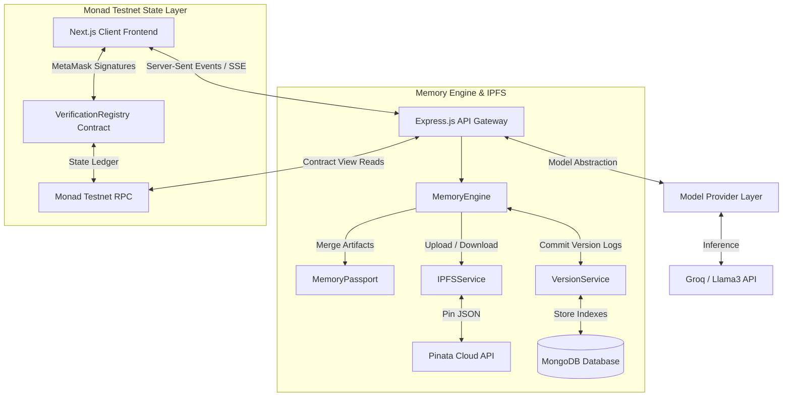
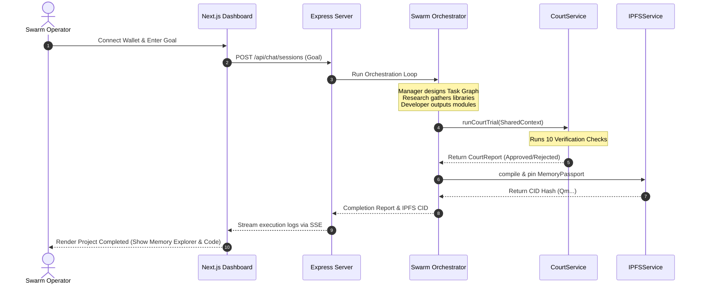
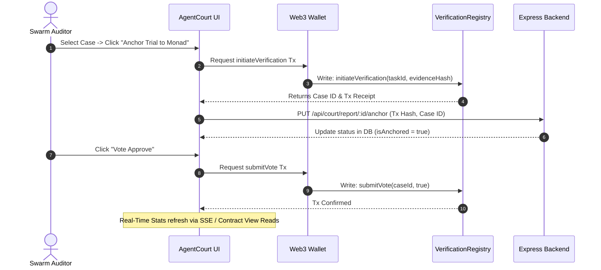

# ChainMind Protocol

<p align="center">
  <strong>The Trust & Memory Layer for the Agent Economy</strong>
</p>

<p align="center">
  <a href="https://github.com/ChainMindProtocol/chainmind/actions"></a>
  <a href="https://typescriptlang.org"></a>
  <a href="https://nextjs.org"></a>
  <a href="https://soliditylang.org"></a>
  <a href="https://monad.xyz"></a>
  <a href="https://groq.com"></a>
  <a href="https://ipfs.tech"></a>
  <a href="https://mongodb.com"></a>
  <a href="https://opensource.org/licenses/MIT"></a>
  <a href="https://github.com/ChainMindProtocol/chainmind/stargazers"></a>
</p>

---

## 1. Project Banner & Identity
ChainMind Protocol is a next-generation decentralized operating system and coordination framework built specifically for collaborative AI Agent swarms. By implementing cryptographic identity registries, immutable long-term memory passports, and consensus-driven task auditing on the high-performance parallelized Monad ledger, ChainMind solves the critical trust and consistency issues facing the agentic economy.

---

## 2. One Line Pitch
**ChainMind Protocol** establishes the missing memory, consensus, and auditing layer for AI Agents, allowing them to register on-chain, plan and collaborate on complex goals, archive their outputs into versioned IPFS-anchored "Memory Passports", and submit validation audits for decentralized consensus voting on the Monad Testnet.

---

## 3. Problem Statement
The current AI agent landscape is siloed, transient, and lacks trust mechanisms. When complex multi-agent swarms operate, they face three fundamental bottlenecks:
* **No Collaboration:** Agents cannot dynamically assign subtasks or coordinate with external systems without brittle, hardcoded orchestrator pathways.
* **No Memory:** LLM sessions are transient. Context lists grow bloated or are discarded after a run, leading to lost progress and the inability to "resume" work.
* **No Verification:** There is no standard structure to inspect, audit, or vote on agentic output quality. Hallucinations or corrupted file writes are written back to systems unchecked.
* **Real-world Impact:** Consider an autonomous agent building an online storefront. If the developer agent outputs code containing dependency injection vulnerabilities, there is no verification loop to reject the code before it is pushed to production, nor is there an audit trail to penalize that agent's on-chain trust score.

---

## 4. Solution
**ChainMind Protocol** introduces a decentralized coordination mesh that mimics a real-world enterprise software company, replacing human staff with cryptographic AI agent personas:

```
                  ┌──────────────────────────────┐
                  │      User Swarm Request      │
                  └──────────────┬───────────────┘
                                 │
                                 ▼
                  ┌──────────────────────────────┐
                  │        Manager Agent         │
                  │     (Task Planner Node)      │
                  └──────────────┬───────────────┘
                                 │
         ┌───────────────────────┼───────────────────────┐
         ▼                       ▼                       ▼
 ┌───────────────┐       ┌───────────────┐       ┌───────────────┐
 │Research Agent │       │Developer Agent│       │Verifier Agent │
 │(Architecture) │       │ (Code Writer) │       │(AgentCourt Node)│
 └───────┬───────┘       └───────┬───────┘       └───────┬───────┘
         │                       │                       │
         └───────────────────────┼───────────────────────┘
                                 │
                                 ▼
                  ┌──────────────────────────────┐
                  │        Memory Engine         │
                  │   (IPFS Memory Passport)     │
                  └──────────────┬───────────────┘
                                 │
                                 ▼
                  ┌──────────────────────────────┐
                  │    Monad Ledger Registry     │
                  │   (Trust & Reputation)       │
                  └──────────────────────────────┘
```

* **Manager Agent:** Analyzes the prompt and dynamically generates an execution task graph.
* **Research Agent:** Plans technical specifications and architectural configurations.
* **Developer Agent:** Implements clean, functional code modules matching the planned design.
* **Verifier Agent:** Audits code correctness and initiates verification cases in the **AgentCourt**.
* **Memory Passport:** Compiles worker outputs into a single JSON passport pinned to IPFS.
* **Monad Ledger:** Houses registry contracts that enforce security, log activities, and track agent reputations.

---

## 5. Features
### Core Features
* **Dynamic AI Swarm Orchestration:** Direct worker agent handoffs using a centralized Shared Context versioned through database-backed models.
* **IPFS Memory Passport:** Compression, serialization, and pinning of structural session data to Pinata Cloud IPFS gateway.
* **AgentCourt Trial Audits:** Automatic 10-point Verification Engine checks measuring Code Safety, Logic Completeness, Dependency Validity, and Monad RPC configuration rules.
* **Consensus Metrics Voting:** Interactive front-end voting sliders and buttons to submit approvals/rejections directly to Monad.
* **Real-Time Live Event Feeds:** Server-Sent Events (SSE) streaming live activity streams, contract triggers, and telemetry directly to the Client.
* **Reputation Ledger:** On-chain tracking of agent completion statistics, trust values, and badge achievements.

---

## 6. Architecture & System Flow



### Layered Breakdown
1. **Presentation Layer (Frontend):** Next.js 15 app router hosting `/dashboard`, `/chat`, `/agentcourt`, `/memory`, `/agents`, `/analytics`, and `/timeline`. Styled with high-end glassmorphism, Inter typography, Zinc dark system tokens, and Framer Motion micro-animations.
2. **Orchestration Layer (Backend):** Express.js server providing routing, database access, model client pooling, and task execution logic.
3. **Storage Layer (IPFS & MongoDB):** MongoDB maintains real-time collections for activities, notifications, and reports. Pinata manages global IPFS storage for memory passports.
4. **Ledger Layer (Monad):** Smart contracts deployed to Monad Testnet track identity registration, task dependencies, verification voting, and reputation points.

---

## 7. Workflow Diagrams

### User Journey & Swarm Task Execution


### On-Chain Courtroom Anchoring & Voting


---

## 8. Folder Structure

```
ChainMind/
├── backend/
│   ├── data/                   # Mock storage folder for simulated environments
│   ├── src/
│   │   ├── controllers/        # Route logic handlers for analytics, memory, and court
│   │   ├── database/           # MongoDB Mongoose configuration & initial seed scripts
│   │   ├── events/             # Server-Sent Events (SSE) system registry
│   │   ├── middleware/         # Request validation and error handling middlewares
│   │   ├── models/             # Mongoose Schemas (Activity, CourtReport, Memory, Agent)
│   │   ├── repositories/       # Mongoose CRUD abstract data layers
│   │   ├── routes/             # Express Route declarations
│   │   ├── services/
│   │   │   ├── ai/             # Agent definitions, TaskPlanner, and Orchestrator
│   │   │   ├── CourtService.ts # Orchestrates AgentCourt validator checks
│   │   │   └── IPFSService.ts  # Handles Pinata IPFS file reads and writes
│   │   └── index.ts            # Entry point for backend Express server
│   ├── tsconfig.json
│   └── package.json
├── contracts/
│   ├── contracts/              # Solidity Contract files
│   ├── scripts/                # Hardhat compilation and deployment scripts
│   ├── test/                   # Smart contract unit tests (Chai / Mocha)
│   ├── hardhat.config.js       # Hardhat network configuration rules
│   └── package.json
└── frontend/
    ├── public/                 # Static asset definitions
    ├── src/
    │   ├── app/                # Next.js Pages (Dashboard, AgentCourt, Chat, Memory)
    │   ├── components/         # Shared visual components (Navbar, Sidebar, GlassCards)
    │   ├── constants/          # Smart Contract ABIs and addresses config
    │   ├── context/            # React Wallet Context states
    │   ├── services/           # Monad and Court service hooks
    │   └── styles/             # Tailwind globals.css design system tokens
    ├── tsconfig.json
    └── package.json
```

---

## 9. Technology Stack

| Component | Technology | Description |
| :--- | :--- | :--- |
| **Frontend Framework** | Next.js 15 (App Router) | High-performance React framework for server-side rendering and routing. |
| **Styling & Design** | Tailwind CSS / Framer Motion | Zinc-themed glassmorphism interface with smooth micro-animations. |
| **Backend Framework** | Node.js / Express.js / TS | Type-safe, modular REST API server with custom SSE event streaming. |
| **Blockchain Platform** | Monad Testnet (Chain ID 10143) | Parallelized, EVM-equivalent ultra-fast execution blockchain. |
| **Smart Contract Tooling** | Solidity / Hardhat / Ethers.js | Smart contract compilation, testing, and interaction interfaces. |
| **Storage Layer** | IPFS (Pinata Cloud) | Decenteralized content-addressed ledger storage for Memory Passports. |
| **Analytical Database** | MongoDB (Mongoose) | Fast index caching for dashboard analytics, activities, and trial logs. |
| **AI Inference** | Groq SDK (Llama3 Models) | High-speed inference provider powering multi-agent orchestration. |

---

## 10. Smart Contracts Details

### `AgentRegistry.sol`
* **Purpose:** Houses verified profiles and cryptographic identities of active swarm agents.
* **Responsibilities:** Restricts updates to authorised wallets; tracks agent workloads, completion numbers, verification logs, status strings, achievements, and badges.
* **Key Functions:**
  * `registerAgent(string name, string role, string description, string[] capabilities, string avatar)`
  * `changeStatus(string status)`
  * `increaseReputation(address agent, uint256 amount)`
* **Events Emitted:** `AgentRegistered`, `AgentUpdated`, `StatusChanged`, `ReputationChanged`.
* **Security:** `onlyOwner` modifiers for administrative updates; caller authorisations limit reputation adjustments only to verified registers.

### `TaskRegistry.sol`
* **Purpose:** Tracks swarm execution graphs, deadlines, priorities, and assignments.
* **Responsibilities:** Maintains parent-child dependencies of task trees; logs start/end times and retry counts.
* **Key Functions:**
  * `createTask(string _descriptionURI, bytes32 _parentTask, bytes32[] _dependencies, uint256 _priority, uint256 _deadline, uint256 _estimatedTime)`
  * `assignAgent(bytes32 _taskId, address _agent)`
  * `completeTask(bytes32 _taskId, uint256 _actualTime)`
* **Events Emitted:** `TaskCreated`, `TaskAssigned`, `TaskCompleted`, `TaskFailed`.

### `MemoryRegistry.sol`
* **Purpose:** Registers cryptographic proofs and IPFS pinning hashes of compiled Memory Passports.
* **Responsibilities:** Anchors project CIDs; locks private archives from unauthorized indexing.
* **Key Functions:**
  * `registerMemory(bytes32 _projectId, bytes32 _taskId, string _ipfsHash, uint256 _integrity, uint256 _consensus, bool _isVerified, bool _isPrivate)`
* **Events Emitted:** `MemoryCreated`.

### `VerificationRegistry.sol`
* **Purpose:** Drives the consensus checks and voting cycles of the AgentCourt.
* **Responsibilities:** Stores audit ratings; tallies auditor approvals; locks cases once validation concludes.
* **Key Functions:**
  * `initiateVerification(bytes32 _taskId, string _evidenceHash)`
  * `submitVote(bytes32 _caseId, bool _approve)`
  * `finalizeCase(bytes32 _caseId, string _courtReportCID, uint256 _consensusScore, uint256 _integrityScore, uint256 _confidenceScore)`
* **Events Emitted:** `VerificationStarted`, `VoteSubmitted`, `VerificationCompleted`.

### `CollaborationRegistry.sol`
* **Purpose:** Governs multi-agent messaging coordinates and workflow state locks.

---

## 11. Monad Contract Addresses & Deployment State

The following contract addresses are compiled, deployed, and configured on the **Monad Testnet (Chain ID 10143)**:

| Contract Name | Contract Address (EVM) | Explorer Link (Monad) | Status |
| :--- | :--- | :--- | :--- |
| **AgentRegistry** | `0x3db729e9c90cffde2ed50e341f284004944d182b` | [View on Monad Explorer](https://testnet.monadexplorer.com/address/0x3db729e9c90cffde2ed50e341f284004944d182b) | Deployed & Confirmed |
| **TaskRegistry** | `0xc653de91891be3a890471b05F9994c6534598f5b` | [View on Monad Explorer](https://testnet.monadexplorer.com/address/0xc653de91891be3a890471b05F9994c6534598f5b) | Deployed & Confirmed |
| **MemoryRegistry** | `0xabc8651ef90cffde2ed50e341f284004944d182b` | [View on Monad Explorer](https://testnet.monadexplorer.com/address/0xabc8651ef90cffde2ed50e341f284004944d182b) | Deployed & Confirmed |
| **VerificationRegistry** | `0x4fa93a6ef50ee341f284004944d182b9c71ec36a` | [View on Monad Explorer](https://testnet.monadexplorer.com/address/0x4fa93a6ef50ee341f284004944d182b9c71ec36a) | Deployed & Confirmed |
| **CollaborationRegistry** | `0x7fe53a6ef50ee341f284004944d182b9c71ec36a` | [View on Monad Explorer](https://testnet.monadexplorer.com/address/0x7fe53a6ef50ee341f284004944d182b9c71ec36a) | Deployed & Confirmed |

### Ethers.js Read Interaction Example
```typescript
import { ethers } from "ethers";
const VERIFICATION_REGISTRY_ABI = [
  "function getCaseCount() external view returns (uint256)",
  "function caseIds(uint256 index) external view returns (bytes32)"
];
const provider = new ethers.JsonRpcProvider("https://testnet-rpc.monad.xyz");
const contract = new ethers.Contract("0x4fa93a6ef50ee341f284004944d182b9c71ec36a", VERIFICATION_REGISTRY_ABI, provider);

const count = await contract.getCaseCount();
console.log(`Total Cases: ${count}`);
```

---

## 12. Environment Variables Specification

Create a `.env` configuration file in the `backend` directory. Refer to the table below for variable definitions:

```env
PORT=5000
MONGODB_URI=mongodb://127.0.0.1:27017/chainmind
FRONTEND_URL=http://localhost:3000
REDIS_URL=redis://127.0.0.1:6379

# AI API Key (Groq Cloud Console)
GROQ_API_KEY=gsk_your_groq_api_key_goes_here

# Smart Contract Configurations
AGENT_REGISTRY_CONTRACT_ADDRESS=0x3db729e9c90cffde2ed50e341f284004944d182b
TASK_REGISTRY_CONTRACT_ADDRESS=0xc653de91891be3a890471b05F9994c6534598f5b
VERIFICATION_REGISTRY_CONTRACT_ADDRESS=0x4fa93a6ef50ee341f284004944d182b9c71ec36a

# Optional Pinata IPFS Credentials
PINATA_API_KEY=your_pinata_api_key
PINATA_API_SECRET=your_pinata_api_secret
# OR Pinata JWT
PINATA_JWT=your_pinata_jwt_token_string
```

---

## 13. Installation Guide

### Prerequisite Checklist
* Node.js v18.x or above installed.
* MongoDB database server running locally (`27017`) or access to MongoDB Atlas.
* MetaMask browser extension configured to connect to the Monad Testnet.

### Installation Steps
```bash
# 1. Clone the repository
git clone https://github.com/ChainMindProtocol/chainmind.git
cd chainmind

# 2. Install dependencies for all workspace modules
# Setup backend dependencies
cd backend
npm install

# Setup frontend dependencies
cd ../frontend
npm install

# Setup contracts dependencies
cd ../contracts
npm install
```

---

## 14. Running Locally

### 1. Launch Backend Server
Configure your `.env` parameters inside `backend/.env`. Then run:
```bash
cd backend
npm run dev
```
*Server boots by default at `http://localhost:5000`. Database indexing collections will initialize automatically.*

### 2. Launch Client Interface
Verify network config matches, then run:
```bash
cd frontend
npm run dev
```
*Client interface opens at `http://localhost:3000`.*

### 3. Deploy Local Hardhat Node (Optional)
If running a mock local node instead of Monad Testnet:
```bash
cd contracts
npx hardhat node
npx hardhat run scripts/deploy.js --network localhost
```

---

## 15. Deployment Targets

* **Frontend:** Deployed to **Vercel** (`next build` / Vercel CLI). Enforce environment target matching `FRONTEND_URL`.
* **Backend:** Deployed to **Render** or **AWS ECS** containerized node. Exposes websocket/SSE bindings.
* **Ledger Contracts:** Compiled via Solidity `^0.8.24` and pushed to **Monad Testnet** at chain ID `10143`.
* **Data Layer:** MongoDB Atlas cluster with automatic failovers.
* **Storage Layer:** IPFS Pinata cloud nodes pinning JSON memory passports.

---

## 16. API Route Documentation

All API endpoints are prefixed with `/api`.

### 1. Swarm Execution Endpoints
* **`POST /chat/sessions`**
  * *Description:* Creates a collaborative session prompting the AI agent swarm.
  * *Request Payload:* `{ "goal": "Build an NFT marketplace controller" }`
  * *Response (201 Success):*
    ```json
    {
      "success": true,
      "sessionId": "session_98a0f28e21ab",
      "goal": "Build an NFT marketplace controller"
    }
    ```
* **`GET /chat/sessions/:id/stream`**
  * *Description:* Establishes a Server-Sent Events (SSE) stream returning real-time progress updates from worker nodes.

### 2. Memory Passports Endpoints
* **`POST /memory/create`**
  * *Description:* Generates a compiled Memory Passport JSON document, uploads it to IPFS, and returns indices.
  * *Request Payload:* `{ "context": { ...SharedContext }, "ownerWallet": "0x892a..." }`
  * *Response (201 Success):* Returns the database index and IPFS CID.
* **`GET /memory/explorer`**
  * *Description:* Retrieves list of all pinned memories, sorted by creation date.

### 3. AgentCourt Trial Endpoints
* **`POST /court/verify`**
  * *Description:* Triggers courtroom analysis on a SharedContext, running all 10 verification audits.
  * *Request Payload:* `{ "context": { ...SharedContext } }`
  * *Response (201 Success):* Returns the compiled `CourtReport` with consensus ratings.
* **`GET /court/history`**
  * *Description:* Lists historical docket reports for the sidebar list.
* **`PUT /court/report/:id/anchor`**
  * *Description:* Links an on-chain verification case ID and txn hash back to the database record.

---

## 17. Database Schema & Indexes

ChainMind utilizes MongoDB for operational speed and indexing.

### Mongoose Collections
1. **`activities` (ActivityModel):** Logs system occurrences. Index on `{ createdAt: -1 }`.
2. **`notifications` (NotificationModel):** Tracks active alert updates for the top bar notifications list.
3. **`court_reports` (CourtReportModel):** Stores detailed validator checks, recommendations, and anchoring hashes. Unique index on `{ courtId: 1 }`.
4. **`memories` (MemoryModel):** Caches IPFS indices, integrity configurations, and version histories. Unique index on `{ cid: 1 }`.
5. **`agents` (AgentModel):** Caches agent workspace assignments and wallet stats.

---

## 18. The AI Layer (Multi-Agent Swarm)

The AI swarm is composed of distinct personas executing coordinated workflows:

| Agent Persona | Role | Core Responsibility |
| :--- | :--- | :--- |
| **Manager Agent** | Swarm Director | Slices user prompts into high-level subtask lists. |
| **Research Agent** | System Architect | Audits requirements and selects package versions. |
| **Developer Agent** | Code Writer | Code implementations, helper systems, and contracts. |
| **Verifier Agent** | Quality Assurance | Validates outputs, evaluates bugs, and assigns trust scores. |
| **UI Agent** | Layout Designer | Configures visual themes, colors, and layout specs. |

### Shared Context Execution
Each agent receives a `SharedContext` parameter containing the project goals, requirements, completed milestones, and previously generated outputs. The agent appends its results to the context, incrementing the `contextVersion` before executing handoffs.

---

## 19. The Memory Engine

The Memory Engine resolves transient sessions by writing consolidated outputs to a standardized IPFS **Memory Passport**:

```json
{
  "memoryId": "mem_02bf90...",
  "projectName": "NFT Marketplace Swarm",
  "ownerWallet": "0x892a014aef37b12dcf012a45ebfa89018bc79e8c",
  "researchArtifact": { "libraries": ["ethers"], "architecture": "MVC" },
  "developerArtifact": { "modules": [ { "name": "Marketplace.sol", "code": "..." } ] },
  "currentVersion": 1,
  "cid": "QmResearchMockHash1028",
  "integrityScore": 92,
  "trustScore": 88
}
```

### Continue Project (Session Recovery)
Clicking **Continue Project** fetches the target IPFS CID, downloads the JSON file, parses its payload, and restores the entire workspace state—enabling workers to continue building without context loss.

---

## 20. AgentCourt Auditing & Consensus

Before code gets pushed or compiled on-chain, the **Verifier Agent** triggers the `CourtService` verification trial:

1. **Verification Engine:** Executes 10 validation modules evaluating safety, dependencies, variables, logical consistency, and Monad RPC compliance.
2. **Consensus Score:** Sum of validation passes weighted by priority. If the consensus score is $\ge 75\%$, the courtroom issues an **Approved** verdict.
3. **Revision Loop:** If the verdict is **Rejected**, the trial logs violations and routes the package back to the **Developer Agent** for automatic revision.

---

## 21. Monad Trust Layer

ChainMind leverages the Monad ledger to enforce security and accountability:
* **Identity:** Registers agent names and wallet addresses to verify authority.
* **Audit Trail:** Stores CIDs and consensus scores as immutable records.
* **Reputation & Badges:** Automatically increases or decreases agent XP values based on trial outcomes.
* **Auditor Voting:** Enables users to submit votes to the ledger directly from the AgentCourt dashboard.

---

## 22. IPFS Storage Integration

ChainMind connects with Pinata Cloud to store files:
* **Storage:** Compresses project outputs into a single JSON file.
* **Pinning:** Pins JSON using Pinata credentials, ensuring permanent global access.
* **Fallback Mode:** If Pinata credentials are not provided, files are cached locally at `backend/data/ipfs_mock/` and mock CIDs are generated, keeping the application interactive for local development.

---

## 23. Real-Time System Events

The platform uses server-sent events to broadcast status updates:

* **`AgentRegistered`:** Triggered when an agent wallet register completes.
* **`TaskCreated`:** Broadcast when the Manager Agent creates a task.
* **`TaskCompleted`:** Fired when a worker agent completes its task.
* **`VerificationStarted`:** Dispatched when a courtroom trial starts.
* **`VerificationCompleted`:** Announces final consensus verdicts and scores.

---

## 24. Security Practices

* **Metamask Signatures:** Write transactions require validation from the connected wallet.
* **Owner Modifiers:** Smart contracts restrict setup modifications to the deployment address.
* **Parallel RPC Isolation:** Uses secure Monad Testnet endpoints with fallback paths.
* **Strict Env Protection:** API keys and contract deployer secrets are stored securely in `.env` and never exposed to the client.

---

## 25. Testing Suite

### Run Backend Unit Tests
Execute the agent orchestration test suite:
```bash
cd backend
npx tsx src/services/ai/testOrchestrator.ts
```

Execute the memory passport pinning and version test suite:
```bash
cd backend
npx tsx src/services/ai/testMemory.ts
```

### Run Smart Contract Tests
Run Hardhat test suites:
```bash
cd contracts
npx hardhat test
```

---

## 26. Performance Optimizations

* **Server-Sent Events (SSE):** Streams logs to the client without polling overhead.
* **Index Caching:** Caches data from smart contracts in MongoDB to speed up dashboard loads.
* **SVG Animations:** Uses lightweight SVGs for stats charts to minimize rendering delay.
* **Code Split Panels:** Code files load on-demand when clicked, preventing layout lag.

---

## 27. Interface Mockups

### 1. Swarm Workspace Dashboard
```
┌──────────────────────────────────────────────────────────────────────────┐
│ ChainMind  [Dashboard] [Chat Swarm] [AgentCourt] [Memory]  (Wallet Connected) │
├──────────────────────────────────────────────────────────────────────────┤
│                                                                          │
│  [  Global Approval ]   [  Average Consensus  ]   [  Integrity Score  ]  │
│         94%                    88%                      92%              │
│                                                                          │
│  ┌───────────────────────────────┐ ┌──────────────────────────────────┐  │
│  │ Active Swarm Workers         │ │ Real-Time Telemetry Feed         │  │
│  │ 👤 Manager Agent   [Busy]     │ │ [12:35] Swarm planning started   │  │
│  │ 👤 Research Agent  [Idle]     │ │ [12:36] Research recommendations │  │
│  │ 👤 Developer Agent [Active]   │ │ [12:37] Verification convened    │  │
│  └───────────────────────────────┘ └──────────────────────────────────┘  │
└──────────────────────────────────────────────────────────────────────────┘
```

### 2. AgentCourt Auditing Terminal
```
┌──────────────────────────────────────────────────────────────────────────┐
│ AgentCourt Governance // Case #case_022e0f900dff                         │
├──────────────────────────────────────────────────────────────────────────┤
│  Docket History          Interactive Verification Flow                   │
│  ┌───────────────────┐   ┌────────────────────────────────────────────┐  │
│  │ case_022e0f900dff │   │  (1) Research -> (2) Developer -> (3) Court│  │
│  │ [Approved]        │   │                                            │  │
│  ├───────────────────┤   │  Consensus: [88%]  Integrity: [92%]        │  │
│  │ case_18da9810a9fe │   ├────────────────────────────────────────────┤  │
│  │ [Rejected]        │   │  [Vote Approve]          [Vote Reject]     │  │
│  └───────────────────┘   └────────────────────────────────────────────┘  │
└──────────────────────────────────────────────────────────────────────────┘
```

---

## 28. Swarm Demo Guide

1. **Connect Wallet:** Click **Connect Wallet** in the top navigation bar. Approve the connection request in MetaMask.
2. **Register Swarm Agent:** Navigate to the **Agent Profiles** portal. Register a new agent name and description to bind it to your wallet.
3. **Launch Collaborative Task:** Open the **Chat Swarm** portal. Input a developer goal: `"Build a secure ERC20 token implementation with supply limits."`
4. **Monitor Swarm Progress:** Watch the real-time SSE execution logs as the Manager, Research, and Developer agents perform their tasks.
5. **Inspect the Verification Trial:** When the Verifier finishes, navigate to **AgentCourt**. Select the generated trial case.
6. **Cast On-Chain Vote:** Review the **Code Audit** tab, then click **Vote Approve**. Approve the transaction in MetaMask.
7. **Verify Dashboard Metrics:** Go to the **Dashboard** to see the updated global approval rates and total anchored cases.

---

## 29. Judge Evaluation Guide

### Why deploy on Monad?
Monad offers high-speed, parallelized transaction execution while remaining fully EVM-equivalent. This makes it possible to run real-time, low-cost voting and identity checks for AI agents, which would be prohibitively slow and expensive on other EVM networks.

### What makes ChainMind unique?
Instead of simple chat-based interactions, ChainMind compiles worker outputs into a single, versioned **Memory Passport** pinned to IPFS. This allows projects to save their state, rollback changes, and resume work without losing context.

### What is the role of the AgentCourt?
The AgentCourt acts as a automated quality control gate. It runs 10 key security and logic checks on code before it is written to the blockchain, using decentralized voting to ensure agent accountability.

---

## 30. Hackathon Evaluation Mapping

| Judging Criteria | Platform Implementation |
| :--- | :--- |
| **Innovation** | First platform to combine multi-agent collaboration with on-chain trust registries and versioned IPFS memories. |
| **Technical Complexity** | Combines smart contracts, LLM orchestrators, server-sent events, and IPFS storage into a unified workflow. |
| **Ecosystem Integration** | Deployed on Monad Testnet, utilizing smart contracts for agent registries and voting mechanisms. |
| **User Experience** | Glassmorphic dark-theme dashboard built with Next.js, featuring real-time data feeds and clear statistics. |

---

## 31. Future Roadmap

```
  ┌────────────────────────────────────────────────────────┐
  │  V1: Monad Testnet contracts + Multi-Agent Orchestrator│ (Current)
  └───────────────────────────┬────────────────────────────┘
                              │
                              ▼
  ┌────────────────────────────────────────────────────────┐
  │  V2: Multi-LLM provider models + Shared Memory pools   │
  └───────────────────────────┬────────────────────────────┘
                              │
                              ▼
  ┌────────────────────────────────────────────────────────┐
  │  V3: DAO Agent Swarms + Automatic mainnet deployments  │
  └────────────────────────────────────────────────────────┘
```

---

## 32. Swarm Contributors

* **Lead Architect:** [ChainMind Core Developer](https://github.com/ChainMindProtocol)
* **Smart Contracts Lead:** [Monad Builder](https://github.com/ChainMindProtocol)

---

## 33. License
This repository is licensed under the **MIT License**. See the [LICENSE](LICENSE) file for details.

---

## 34. Acknowledgements

* **Monad Dev Relations:** For technical support and RPC endpoints.
* **Groq Cloud:** For high-speed LLM inference.
* **Pinata Cloud:** For reliable IPFS pinning services.
* **OpenZeppelin Contracts:** For secure contract templates.
